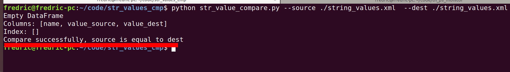

# Str Value Compare Project

## Background

Since we want to compare the source XML generated by developer and the corresponding files provided by the translation company. We build this project.

## Usage 

Provide the source xml file offered by developers, then the destination file, it can run the comparison process and give you corresponding result.
```shell
python str_value_compare.py --source {Source Xml file} --dest {Dest Translation file}
```

Result is as belows,

